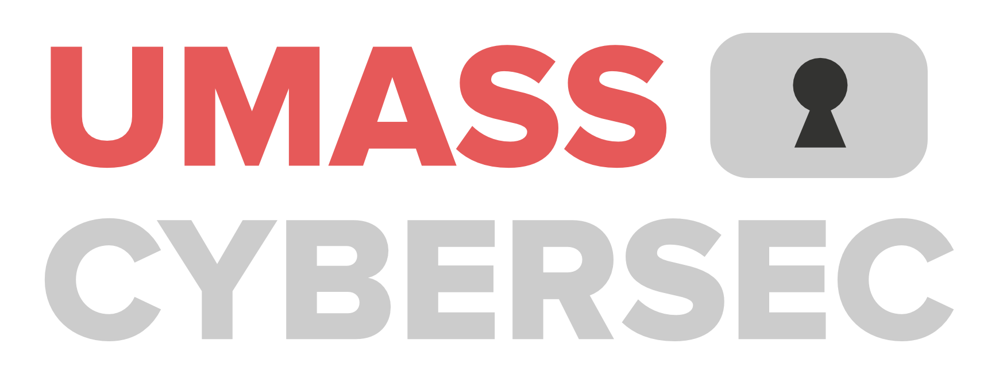

<p align="center">
  
  
</p>

---
<p align="center">
  <h3 align="center">
    <a href="https://ctf.umasscybersec.org/"> 🚩 UMass CTF 2025 </a> 
  </h3>
  <h3 align="center">
    🕠 Date: April 18th 2 PM - 20th 8 PM 
  </h3>
</p>

---
* [🚩 What is UMassCTFd?](#-UMassCtfd)
    + [📖 Overview](#-overview)
    + [🏗️ Architecture](#-architecture)
* [🚀 Quickstart - *for challenge authors*](#-quickstart)
    + [💻 Writing Challenges](#-writing-challs)
    + [🎉 Deploying Challenges](#-deploying-challs)
    + [ 🎮 Playtesting Challenges](#-deploying-challs)
    + [✏️ Editing Challenges](#-editing-challs)
* [🛠️  Installation & Deployment - *for infra team*](#-deploy)
    + [1️⃣ Provision Cloud or On-Prem Services](#-provision)
    + [2️⃣  Setup CTFd](#-setup-ctfd)
    + [ 3️⃣ Configure Github Repo & Actions](#-github-repo)
---

## 🚩 What is UMassCTFd?  

UMassCTFd is an automated challenge + CTFd deployer used to provision and manage UMass Cybersecurity Club's CTFs and internal training platforms. 

###  📖 Overview

**Challenge Categories:**

Each challenge category will have its own subdirectory under `/challenges`. All challenge directories must be placed in a subdirectory under `/challenges/${CATEGORY}`
```
# Example Structure

/challenges/
 ├── crypto/
 │    ├── challenge1/
 │    ├── challenge2/
 ├── web/
 │    ├── challenge1/
 │    ├── challenge2/
```

The categories are: 
-  🔐 crypto 
- 🔍 forensics 
-  🔌hardware 
- 🎲 misc 
- 💣 pwn
- 🔄 rev 
-  🌐 web
- 🌍 OSINT 

To add a new category, you can just create a new subdirectory under `/challenges`.

**Challenge Contents:**  
We support automated deployment of challenges with static assets, interactive docker containers, both or neither, and even more complicated setups (via Docker Compose)!  


**Environments:**  
We have a "dev" and "prod" environment, each with an associated Github branch.  
As per best GitOps practices 🤓, you should play test your challenge in the dev environment first before promoting it to prod.   

> [!NOTE]  
> Our prod environment will not be set up until ~1 week before the CTF to reduce infrastructure costs.

###  🏗️ Architecture

This repo is the *SINGLE SOURCE OF TRUTH*. Every challenge's information on CTFd (ex. description, points, etc.) & source code will live here. 

> [!WARNING]  
> Making manual changes in CTFd *WILL* get overriden by our CI/CD pipelines. Deploying and updating challenges should only be done through this repo. 
> We plan to add support for updating/syncing challenge information in CTFd as well in the near future.  

Both CTFd and all challenges are hosted on GCP. The diagram below gives a high-level overview of how our infrastructure works:  

## 🚀 Quickstart 

### 💻 Writing Challenges

> [!IMPORTANT]
> Flag Format: `UMASS{FLAG}`


#TODO fix this up, go over info.yaml  
    Create a new directory in the appropriate category for your challenge.
        Use the following format (challenges/[category]/[challenge name])
            Please make sure the challenge name does not contain any underscores, capital letters, or special characters.
        Each challenge should have the following things at the top level:
            an optional static folder with downloadable assets
            a Dockerfile/docker-compose.yaml and a config.env if dynamic (see this config.env for reference)
            info.yaml (see this info.yaml for reference)
    Create a PR to merge into the dev branch.
    Test your challenges in the CTFd dev environment. Create any follow up PRs as necessary to make edits to your challenge.
    Create a PR to promote your challenge to the prod branch.

### 🎉 Deploying Challenges

**End to End Tests**
Before deploying your challenge, you must validate that the automatic end to end(E2E) tests have passed. 
#TODO: say what we test, include screenshot of green check mark, include instructions for troubleshooting if they fail 

**Merging**
#TODO PR reivew (ping someone)? 
#TODO: also put don't edit main branch and stuff in here 

### 🎮 Playtesting Challenges
#TODO: put connection info in here 

### ✏️ Editing Challenges

## 🛠️  Installation & Deployment

### 1. Provision Cloud or On-Prem Services 
Challenges can be deployed on virtual machines hosted on a cloud platform or on-prem servers.  

<details>
  <summary><h4>GCP</h4></summary>

**1. Create a GCP project**  
```sh
# TODO: replace ${PROJECT_NAME} with your GCP project name 

gcloud projects create PROJECT_ID --name="${PROJECT_NAME}"
```

**2. Authenticate with the GCP CLI**  
```sh
gcloud auth login
```
**3. Set GCP CLI project config**  
```sh
# TODO: replace ${PROJECT_ID} with your GCP project ID 

gcloud config set project ${PROJECT_ID}
```

**4. Create a VM for each challenge category**  
```sh
# TODO: replace ${CATEGORY_1} ${CATEGORY_2} ... ${CATEGORY_N} with your challenge categories; replace ${ZONE} and ${MACHINE_TYPE} with your GCP zone and Compute Engine machine type respectively 

for category in ${CATEGORY_1} ${CATEGORY_2} ${CATEGORY_N}; do
  gcloud compute instances create "${category}-challs" --zone=${ZONE} --machine-type=${MACHINE_TYPE}
done

# Example: 
# for category in web pwn misc; do
#   gcloud compute instances create "${category}-challs" --zone=us-east1-b --machine-type=e2-medium
# done
```

**5. Expose ports** #TODO 
```sh
gcloud compute firewall-rules create allow-http --allow=tcp:80
```
**6. Authenticate to GCP via Workload Identity Federation**

This [repo](https://github.com/google-github-actions/auth) has detailed documentation about Github Action authentication to GCP.

> [!NOTE]
> Woarkload Identity Federation is used to establish a trust delgation relationship between Github Actions workflow invocation and GCP permissions without storing service account keys to avoid long-lived credentials. 
> Definitions: 
> - Workload Identity Pool: "container" for external identities, groups multiple identity providers (ex. Github) and allows them to assume GCP IAM roles; the Workload Identity Pool will have direct IAM permissions on GCP resources.
> - Workload Identity Provider: specific OIDC identity source (ex. Github) within a Workload Identity Pool 

*6a. Create a Workload Identity Pool*
```sh 
# TODO: replace ${PROJECT_ID} with your value below.

gcloud iam workload-identity-pools create "github" \
  --project="${PROJECT_ID}" \
  --location="global" \
  --display-name="GitHub Actions Pool"
```

*6b. Get full ID of Workload Identity Pool* 
```sh
# TODO: replace ${PROJECT_ID} with your value below.

gcloud iam workload-identity-pools describe "github" \
  --project="${PROJECT_ID}" \
  --location="global" \
  --format="value(name)"

# value should be of format `projects/123456789/locations/global/workloadIdentityPools/github`
```

*6


</details>

<details>
  <summary><h4>Proxmox</h4></summary>
  This is the hidden content that appears when you click the summary.
</details>

### 2. Set up CTFd

### 3. Configure Github Repo &  Actions 
---
#TODO:
- squash commits
- why isnt [!NOTE] working?
- TODO: fix replacements in the workload identity provider
- make the workloa didentity provider steps a substep
- make sure to mention access in terms of merging, who to ping, etc.
- have the dev environment setup and have IP and password information in this README so people can connect to dev instance

