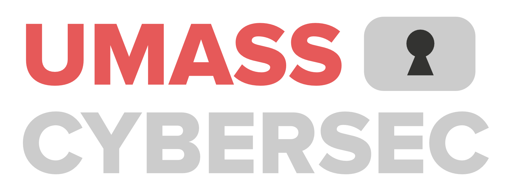
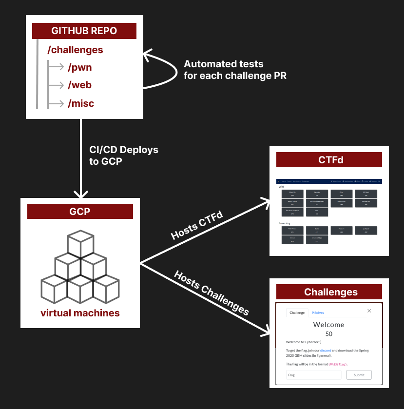
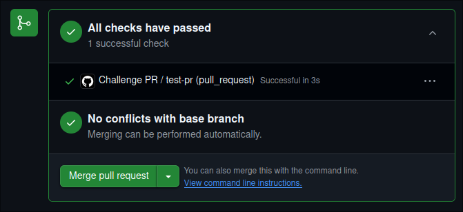
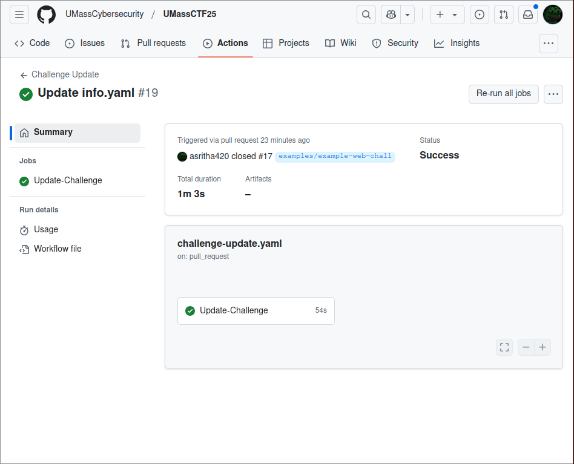
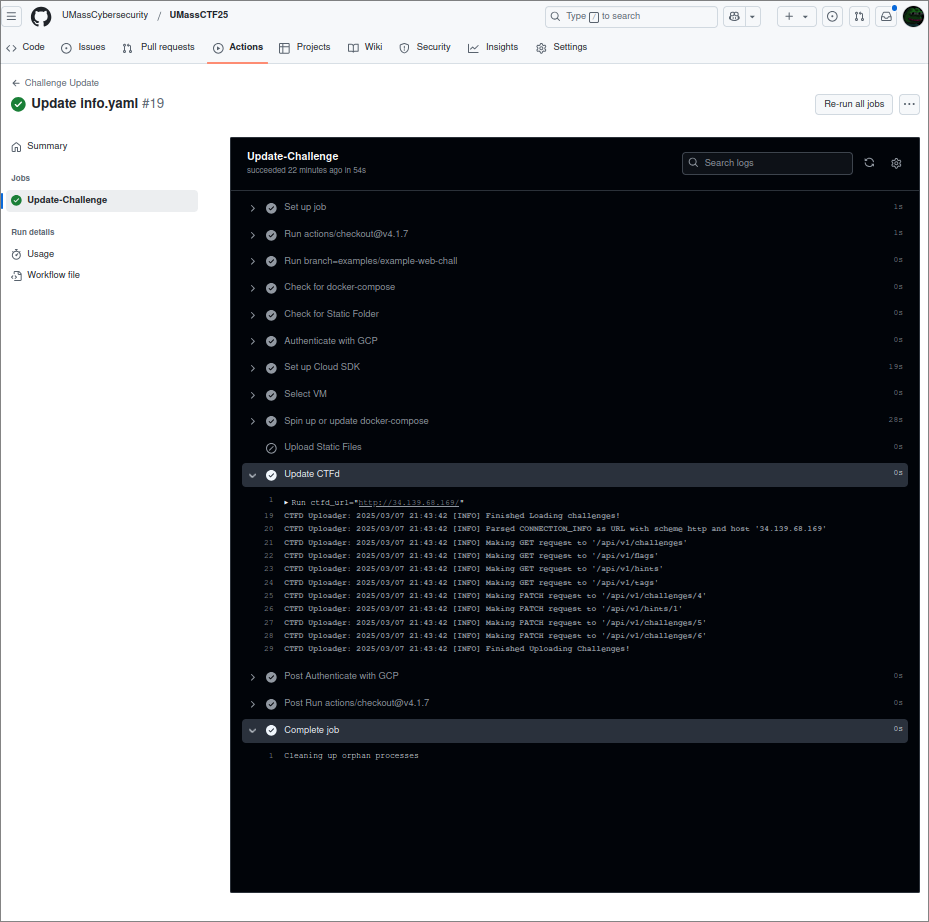

<p align="center">
  
  
</p>

---
<p align="center">
  <h3 align="center">
    <a href="https://ctf.umasscybersec.org/"> 🚩 UMass CTF 2025 </a> 
  </h3>
  <h3 align="center">
    🕠 April 18th, 2:00 PM EST - April 20, 8:00 PM EST 
  </h3>
</p>

---
- [🚩 What is UMassCTFd?](#-what-is-umassctfd)
  - [📖 Overview](#-overview)
  - [🏗️ Architecture](#️-architecture)
- [🚀 Quickstart - *for challenge authors*](#-quickstart---for-challenge-authors)
  - [💻 Writing Challenges](#-writing-challenges)
  - [🎉 Deploying Challenges](#-deploying-challenges)
  - [🎮 Playtesting Challenges](#-playtesting-challenges)
    - [Dev CTFd Environment](#dev-ctfd-environment)
    - [🔗 Accessing Your Deployed Challenge](#-accessing-your-deployed-challenge)
    - [✅ Playtesting Assignments](#-playtesting-assignments)
  - [✏️ Editing Challenges](#️-editing-challenges)
- [🛠️  Installation \& Deployment - *for infra team*](#️--installation--deployment---for-infra-team)
- [🎨 Extending UMassCTFd](#-extending-umassctfd)

---

## 🚩 What is UMassCTFd?  

UMassCTFd is an automated challenge + CTFd deployer used to provision and manage UMass Cybersecurity Club's CTFs and internal training platforms. 

**What is CTFd?**

CTFd is an open-source Capture The Flag (CTF) platform used for hosting cybersecurity competitions, training platforms, etc. It provides a customizable interface and API for managing challenges, teams, scoring, and event logistics.

###  📖 Overview

**Challenge Categories:**

Each challenge category will have its own subdirectory under `/challenges`. All challenge directories must be placed in a subdirectory under `/challenges/${CATEGORY}/`
```
# Example Structure

/challenges/
 ├── crypto/
 │    ├── challenge1/
 │    ├── challenge2/
 ├── web/
 │    ├── challenge1/
 │    ├── challenge2/
```

The default challenge categories are:
- crypto 
- forensics 
- hardware 
- misc 
- pwn 
- rev
- web 
- OSINT

To add a new category, you can just create a new subdirectory under `/challenges`.

**Challenge Contents:**  
We support automated challenge deployments with:
- Static assets (e.g., downloadable files)
- Running services (e.g., websites, APIs, network services)
  Both or neither
- More advanced setups, including multi-container deployments (e.g., databases, message queues, or custom infrastructure)

**Environments:**   
We maintain two environments: **dev** and **prod**, each linked to a corresponding GitHub branch.  Following GitOps best practices 🤓, all challenges should be tested in dev before being promoted to prod.

> [!NOTE]  
> The prod environment will only be set up **~1 week before** the CTF to minimize infrastructure costs.

### 🏗️ Architecture
This repository serves as the **single source of truth** for all challenges.  
It contains both:
- Challenge metadata (e.g., descriptions, points, etc.)
- Source code

> [!WARNING]  
> **Manual changes in CTFd will be overwritten** by our CI/CD pipelines.  
> All deployments and updates must be done through this repo!  
> (We plan to add support for editing challenge data in CTFd directly soon!)

Our **CTFd** instances and all challenges are hosted on **GCP**. The diagram below provides a high-level overview of our infrastructure:




<br>

## 🚀 Quickstart - *for challenge authors* 

> **Important:** We have three example challenges under `/challenges/examples/`. Please use them as a reference!
### 💻 Writing Challenges

> [!IMPORTANT]
> Flag Format: `UMASS{FLAG}`

> Ensure your challenge name follows this regex pattern:  
> `^[A-Za-z][A-Za-z0-9-]*$`

1. **Create a new branch** for your challenge using the format:
`${CHALLENGE_CATEGORY}/${CHALLENGE_NAME}`

2.  **Create a new directory** for your challenge within the appropriate category directory:  
   `/challenges/${CHALLENGE_CATEGORY}/${CHALLENGE_NAME}`  
3. **Each challenge directory must include the following files:**

   - **Required:**
    - `info.yaml`: Stores the challenge metadata used for the CTFd entry, including details like the challenge's display name, point value, flags, etc.    
    This file is directly used to create or update your challenge in CTFd.  For complete documentation on structuring this file, **refer to `docs/info.yaml`** and `docs/full-info.yaml`.  

   - **Optional (depending on challenge type):**
     - `solve.py`: An automated script that replicates the steps required to solve a challenge, including sending requests, performing exploits, or processing data to retrieve the flag.
     - **Static downloadable assets:**  
       If the challenge includes static downloadable assets (e.g., images, source code files), create a `static` subdirectory to store them.
     - **Running services:**  
       If the challenge requires running services (e.g., a website, interactive script), include a `docker-compose.yaml` file.
       
       <details>
         <summary>Need a separate instance for each connection?</summary>
         
         If your service should **start a fresh instance per user connection** (e.g., for binary exploitation or sandboxed environments), use `ynetd` in your `Dockerfile`.  
         `ynetd` ensures each connection gets its own isolated process without reusing state from previous users.
         
         ```dockerfile
         # Example
         FROM debian:latest
         RUN apt update && apt install -y ynetd
         COPY challenge_binary /challenge
         CMD ["ynetd", "-p", "1337", "-u", "nobody", "--", "/challenge"]
         ```
       </details>
       
       <details>
         <summary>Running multiple services?</summary>
         
         If your challenge requires multiple services (e.g., a database, chat bot, API, etc.), you can define them in your `docker-compose.yaml` file.  
         This allows you to specify how different containers interact with each other.
         
         ```yaml
         # Example 
         version: "3"
         services:
           web:
             build: ./web
             ports:
               - "8080:80"
           db:
             image: mysql:latest
             environment:
               MYSQL_ROOT_PASSWORD: root
               MYSQL_DATABASE: challenge_db
           bot:
             build: ./bot
             depends_on:
               - db
         ```
         In this example:
         - `web` is a service running a website.
         - `db` is a MySQL database.
         - `bot` is a chatbot that depends on the database.
       </details>
       
       <details>
         <summary>To choose a public port for your services:</summary>
         
         Each category has a predefined public port range:
         - **Pwn**: `30000-31000`
         - **Crypto**: `40000-41000`
         - **Web**: `50000-51000`
         - **Other**: `60000-61000`   
         
         To expose a port publicly in a Docker Compose file, use the `ports` directive in the service definition.
         
         ```yaml
         # Example 
         services:
           myapp:
             image: myapp:latest
             ports:
               - "8080:80" # Maps port 80 inside the container to port 8080 on the host, making it accessible publicly.
         ```
         
         **Assign unique ports:** 
         All challenges must use a unique port within their category's assigned range. To prevent conflicts:
         - Update the port-tracker file by adding your challenge’s assigned port to `docs/port-tracker.md`.
         - Ensure that no other challenge is already using the same port.
       </details>


### 🎉 Deploying Challenges

1. **Create a Pull Request (PR)** for your branch.  

2. Ensure **all pre-merge checks have passed** before deploying your challenge.
   - These checks verify that your `info.yaml` file includes **all required fields**.  
   - You should see a green checkmark on your PR, confirming that the checks have completed successfully:  

       

3. **Get approval if required.**  
   - Permissions are based on your team assignment: `UMassCTF25-Admins` and `UMassCTF25-Challenge-Authors`.  
   - If you're in the `UMassCTF25-Challenge-Authors` group, you **must** get approval from an `UMassCTF25-Admins` before merging your PR.  
   - You can find the admin list .  

4. **Merge your PR** into the `dev` branch. 

5. **Verify the `challenge-update` pipeline passes**  
- Our "upload" pipeline is responsible for deploying your challenge to the GCP VM and updating or creating an entry in CTFd using the details from `info.yaml`. To ensure everything works correctly, check if this pipeline succeeds.  
- You can monitor the workflow run on the **Actions** page—look for a job named **"Challenge Update"**, which corresponds to the last commit message in your PR:
<p align="center">
  
  
</p>

- If the pipeline fails, review the error messages provided in the workflow logs. These messages are detailed and will help you troubleshoot any issues.

6. **After playtesting and finalizing your challenge in our dev CTFd environment, create a new PR to promote to the `prod` branch.**  
   - Repeat steps 1-3, then merge your PR to the `prod` branch.  

7. **Delete** your challenge's branch. 


### 🎮 Playtesting Challenges

> [!IMPORTANT]
> Connecting to our dev environment **requires a WireGuard VPN connection**. We'll be setting this up in the next few days and updating the README with connection instructions.

#### Dev CTFd Environment  
The dev CTFd environment is where we can **test, iterate on challenges, and make changes** before promoting them to the production CTFd environment. 

#### 🔗 Accessing Your Deployed Challenge  
1. Navigate to: **[`34.139.68.169`](http://34.139.68.169)**  
2. **Create an account** in the dev CTFd environment using the registration code below:  

   Registration Code: `D3v0psCluB_1s_Bett3r_C0de!6969`

3. **Admin Credentials** (for infra/admin team and CTF leads):  

   Username: `admin`  
   Password: `D3v0psCluB_1s_Bett3r!`


#### ✅ Playtesting Assignments  
- Check the **playtesting spreadsheet** for your assigned tasks:  
  **[Playtesting Status & Assignments](https://docs.google.com/spreadsheets/d/1qIww51LLm-_pstBHafcTBl6caXEumyQlD3uW41yzdFE/edit?gid=0#gid=0)**
- Complete your assigned tests and **update the status** accordingly.
- If anything is unclear or broken, leave comments in the spreadsheet and let the challenge author know.

### ✏️ Editing Challenges

> [!WARNING] 
> Do **not** edit your challenges directly in the `dev` or `prod` branches, even if you have the necessary permissions. Doing so can cause unintended issues, and your changes may not be properly deployed. **Always make edits through pull requests (PRs)!**

1. Use the branch you originally created to make edits to your challenge.  
2. Follow the **promotion process steps** again to push your changes.  

<br>
  
## 🛠️  Installation & Deployment - *for infra team*
> 🚧 **This documentation is still under construction!** 🚧  


## 🎨 Extending UMassCTFd

> 🚧 **This documentation is still under construction!** 🚧  
