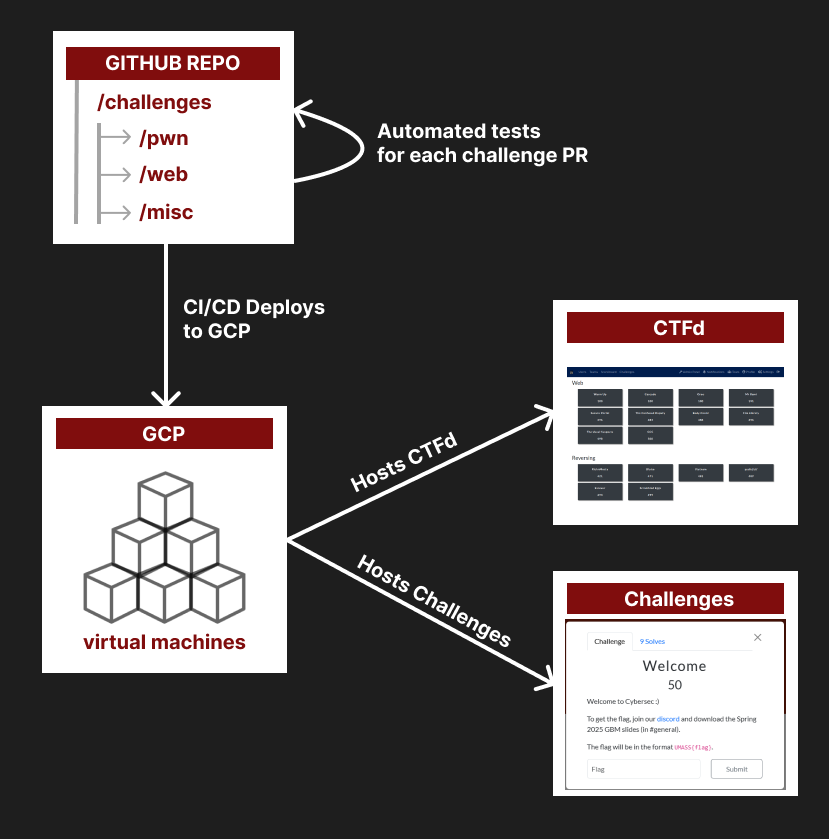
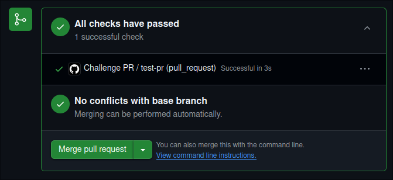

<p align="center">
  
  
</p>

---
<p align="center">
  <h3 align="center">
    <a href="https://ctf.umasscybersec.org/"> 🚩 UMass CTF 2025 </a> 
  </h3>
  <h3 align="center">
    🕠 April 18th, 2:00 PM EST - April 20, 8:00 PM EST 
  </h3>
</p>

---
- [🚩 What is UMassCTFd?](#-what-is-umassctfd)
  - [📖 Overview](#-overview)
  - [🏗️ Architecture](#️-architecture)
- [🚀 Quickstart - *for challenge authors*](#-quickstart---for-challenge-authors)
  - [💻 Writing Challenges](#-writing-challenges)
  - [🎉 Deploying Challenges](#-deploying-challenges)
  - [🎮 Playtesting Challenges](#-playtesting-challenges)
    - [Dev CTFd Environment](#dev-ctfd-environment)
    - [🔗 Accessing Your Deployed Challenge](#-accessing-your-deployed-challenge)
    - [✅ Playtesting Assignments](#-playtesting-assignments)
  - [✏️ Editing Challenges](#️-editing-challenges)
- [🛠️  Installation \& Deployment - *for infra team*](#️--installation--deployment---for-infra-team)
- [🎨 Extending UMassCTFd](#-extending-umassctfd)

---

## 🚩 What is UMassCTFd?  

UMassCTFd is an automated challenge + CTFd deployer used to provision and manage UMass Cybersecurity Club's CTFs and internal training platforms. 

**What is CTFd?**


###  📖 Overview

**Challenge Categories:**

Each challenge category will have its own subdirectory under `/challenges`. All challenge directories must be placed in a subdirectory under `/challenges/${CATEGORY}/`
```
# Example Structure

/challenges/
 ├── crypto/
 │    ├── challenge1/
 │    ├── challenge2/
 ├── web/
 │    ├── challenge1/
 │    ├── challenge2/
```

The default challenge categories are:
- crypto 
- forensics 
- hardware 
- misc 
- pwn 
- rev
- web 
- OSINT

To add a new category, you can just create a new subdirectory under `/challenges`.

**Challenge Contents:**  
We support automated deployment of challenges with static assets, interactive Docker containers, both or neither, and even more complicated setups (via Docker Compose)!  

**Environments:**  
We have a "dev" and "prod" environment, each with an associated Github branch.  
As per best GitOps practices 🤓, you should play test your challenge in the dev environment first before promoting it to prod.   

> [!NOTE]  
> Our prod environment will not be set up until ~1 week before the CTF to reduce infrastructure costs.

###  🏗️ Architecture

This repo is the *SINGLE SOURCE OF TRUTH*. Every challenge's information on CTFd (ex. description, points, etc.) & source code will live here. 

> [!WARNING]  
> Making manual changes in CTFd *WILL* get overriden by our CI/CD pipelines. Deploying and updating challenges should only be done through this repo. 
> We plan to add support for updating/syncing challenge information in CTFd as well in the near future.  

Both CTFd and all challenges are hosted on GCP. The diagram below gives a high-level overview of how our infrastructure works:  



<br>

## 🚀 Quickstart - *for challenge authors* 

### 💻 Writing Challenges

> [!IMPORTANT]
> Flag Format: `UMASS{FLAG}`

> Ensure your challenge name follows this regex pattern:  
> `^[A-Za-z][A-Za-z0-9-]*$`

1. **Create a new branch** for your challenge using the format:
`${CHALLENGE_CATEGORY}/${CHALLENGE_NAME}`

2.  **Create a new directory** for your challenge within the appropriate category directory:  
   `/challenges/${CHALLENGE_CATEGORY}/${CHALLENGE_NAME}`  

3. **Each challenge directory must include the following files:**  
   - **Required:**  
     - `info.yaml`: Contains the challenge metadata (used for CTFd entry).  #TODO: link reference.yaml #TODO: explain what this file is, explain more detail  
   - **Optional (depending on challenge type):**  
     - If the challenge includes **static downloadable assets** (e.g., images, source code files), create a `static` subdirectory to store them.  
     - If the challenge requires **running services** (e.g., a website, interactive script), include a `docker-compose.yaml` file.
       - <details>
         <summary>Need a separate instance for each connection?</summary>
         
         If your service should **start a fresh instance per user connection** (e.g., for binary exploitation or sandboxed environments), use `ynetd` in your `Dockerfile`.  
         `ynetd` ensures each connection gets its own isolated process without reusing state from previous users.
         
         Example:
         ```dockerfile
         FROM debian:latest
         RUN apt update && apt install -y ynetd
         COPY challenge_binary /challenge
         CMD ["ynetd", "-p", "1337", "-u", "nobody", "--", "/challenge"]
         ```
         </details>
       - <details>
         <summary>Running multiple services?</summary>
         
         If your challenge requires **multiple services** (e.g., a database, chat bot, API, etc.), you can define them in your `docker-compose.yaml` file.  
         This allows you to specify how different containers interact with each other.
         
         Example:
         ```yaml
         version: "3"
         services:
           web:
             build: ./web
             ports:
               - "8080:80"
           db:
             image: mysql:latest
             environment:
               MYSQL_ROOT_PASSWORD: root
               MYSQL_DATABASE: challenge_db
           bot:
             build: ./bot
             depends_on:
               - db
         ```
         In this example:
         - `web` is a service running a website.
         - `db` is a MySQL database.
         - `bot` is a chatbot that depends on the database.
         
        </details>


**Choosing a Public Port**


- Use base image of alpine wnv possible (ex-alpine) # link video of how to make docker images smaller (provide the tips and tricks here?) -> checklist dropdown?  

Exposing ports: 

Pwn: 30000-31000
Crypto: 40000-41000
Web: 50000-51000
Other: 60000-61000


### 🎉 Deploying Challenges

1. **Create a Pull Request (PR)** for your branch.  

2. Ensure **all pre-merge checks have passed** before deploying your challenge.
   - These checks verify that your `info.yaml` file includes **all required fields**.  
   - You should see a green checkmark on your PR, confirming that the checks have completed successfully:  

    #TODO: put red square 
       

3. **Get approval if required.**  
   - Our Github organization has two teams: `admins` and `authors`.  
   - If you're in the `author` group, you **must** get approval from an `admin` before merging your PR.  
   - If approval is needed, your PR will display a message like this:  
     
       

   - **Admins List:** Below is a list of admins you can contact for approval. You can also find all user accounts and groups [here](#).  

#TODO: put table with discord handles

     **Admin Contacts (Click to Expand)**  
     <details>
       <summary>Admins</summary>
       - Admin1#1234  
       - Admin2#5678  
       - Admin3#9012  
     </details>

4. **Merge your PR** into the `dev` branch. 

5. **After playtesting and finalizing your challenge in our dev CTFd environment, create a new PR to promote to the `prod` branch.**  
   - Repeat steps 1-3, then merge your PR to the `prod` branch.  

6. **Delete** your challenge's branch. 


### 🎮 Playtesting Challenges

> [!IMPORTANT]
> Connecting to our dev environment **requires a WireGuard VPN connection**. We'll be setting this up in the next few days and updating the README with connection instructions.

#### Dev CTFd Environment  
The dev CTFd environment is where we can **test, iterate on challenges, and make changes** before promoting them to the production CTFd environment. 

#### 🔗 Accessing Your Deployed Challenge  
1. Navigate to: **[`34.139.68.169`](34.139.68.169)**  
2. **Create an account** in the dev CTFd environment using the registration code below:  

   Registration Code: `D3v0psCluB_1s_Bett3r_C0de!6969`

3. **Admin Credentials** (for infra/admin team and CTF leads):  

   Username: `admin`  
   Password: `D3v0psCluB_1s_Bett3r!`


#### ✅ Playtesting Assignments  
- Check the **playtesting spreadsheet** for your assigned tasks:  
  **[Playtesting Status & Assignments](https://docs.google.com/spreadsheets/d/1qIww51LLm-_pstBHafcTBl6caXEumyQlD3uW41yzdFE/edit?gid=0#gid=0)**
- Complete your assigned tests and **update the status** accordingly.
- If anything is unclear or broken, leave comments in the spreadsheet and let the challenge author know.

### ✏️ Editing Challenges

> [!WARNING] 
> Do **not** edit your challenges directly in the `dev` or `prod` branches, even if you have the necessary permissions. Doing so can cause unintended issues, and your changes may not be properly deployed. **Always make edits through pull requests (PRs)!**

1. Use the branch you originally created to make edits to your challenge.  
2. Follow the **promotion process steps** again to push your changes.  

<br>
  
## 🛠️  Installation & Deployment - *for infra team*
> 🚧 **This documentation is still under construction!** 🚧  


## 🎨 Extending UMassCTFd

> 🚧 **This documentation is still under construction!** 🚧  
